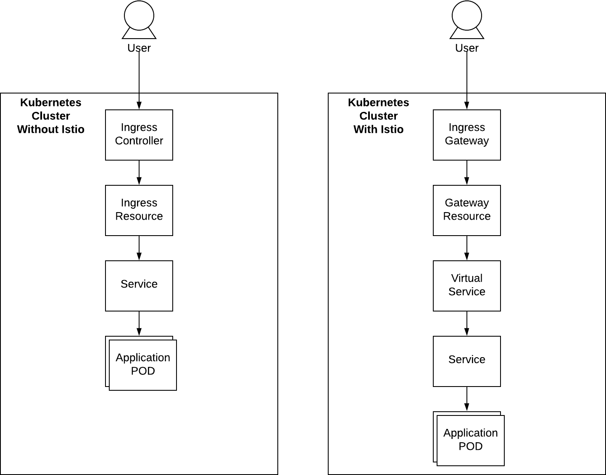

## Part 0: Setting up and orientation

1. Clone BIED repository:  
   `$ git clone https://github.com/Choem/bied.git`
2. Use helm to deploy Istio:  
   `$ helm install istio ./bied/gateway`
3. Wait till ready:  
   `$ watch kubectl get deployment -n istio-system`
   ```
     NAME                   READY   UP-TO-DATE   AVAILABLE   AGE
     istio-ingressgateway   1/1     1            1           34s
     istiod                 1/1     1            1           34s
   ```

### What is Istio and why do we need it?

Istio creates a service mesh with the help of several tools. In simple terms a service mesh manages communication between services, this includes routing, authentication, authorization, metrics and way more. To create this service mesh, Istio injects every Kubernetes Pod with a proxy. This proxy can then act on the traffic that passes and collect metrics.

Istio uses the very popular [Envoy Proxy](https://www.envoyproxy.io/) developed by Lyft and is provided as Open-Source software. Envoy is designed for cloud applications and has excellent support for modern technologies such as HTTP/2.0 and GRPC.

A common method to expose service in a Kubernetes cluster is by using Ingress and Ingress Controllers. Unfortunately this setup limits us in functionality. As example: it is often not possible to route based on more than just hostnames and paths such as headers. Besides that there is not an option for testing features such as Fault-Injection. If these features exist they will most likely have to be configured in the Ingress Controller - which might require rebuilding or restarting - or it is configured using annotations in the Ingress Resource which is not pretty.

#### New resources

Istio introduces a handfull of new Kubernetes resources. Most of these resource will be touched on throughout this guide. The most important two are the `Gateway` and `VirtualService` resource which allows for all features mentioned earlier.

Below is a side-by-side comparison to a setup with an Ingress Controller and a setup using Istio. Notice that the Istio resources are not replacements but function differently.



## [Part 1: Creating a GRPC Protobuffer](../1_grpc_proto/readme.md)
