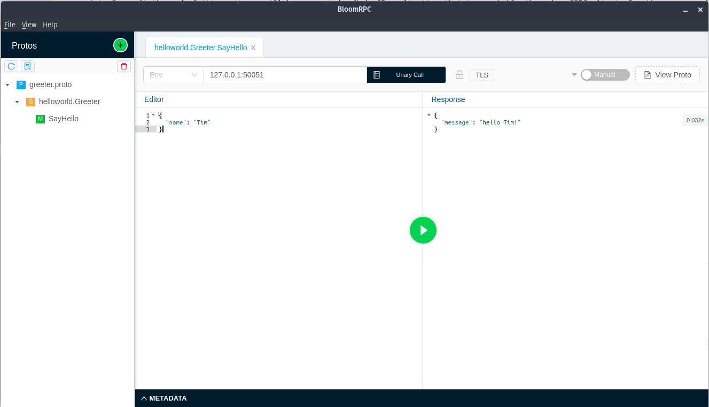

## Part 2: Implementing the GRPC Service in an Application

GRPC Protobuffers are really only an interface, they describe services and methods but do not implement them. This part of the guide will implement that interface. At the end of this part you will have created a Node.JS application that is reachable through a GRPC client. And for later in this guide, we will also add an health-check endpoint implemented in HTTP at `/health`.

### Requirements and dependencies

Ofcourse you are going to need Node.JS with NPM (it comes bundles). Download it [here](https://nodejs.org).

Once you have Node.JS installed, run `npm install` in this folder. This folder already contains a `package.json` which lists all required dependencies. These include the following:

- **express** - HTTP server wrapper for APIs
- **grpc** - GRPC library for server/client communication
- **google-protobuf** - Protobuffer runtime library

### First steps

_TODO_

Test if everything works as expected by running main.js:

```
$ node src/main.js
GRPC Server started
HTTP Server started
```

### Testing the application

You should now be able to reach `127.0.0.1:3000/health` in the browser and get a response with `ready:true`. And most importantly you should now be able to reach the GRPC server with a client of your choice. In both cases ensure that you are sending plaintext and not using TLS, since TLS is disabled in this example.

**Using GRPCurl:**

```
$ grpcurl
    -d '{"name":"Tim"}'
    -plaintext
    -proto ../1_grpc_proto/helloworld.proto
    localhost:50051
    helloworld.Greeter/SayHello

# In one line
$ grpcurl -d '{"name":"Tim"}' -plaintext -proto ../1_grpc_proto/helloworld.proto localhost:50051 helloworld.Greeter/SayHello
```

**Using BloomRPC:**


### Create Docker image

Since we are going to run this application in our kubernetes cluster, let us build the Docker Image.
Now build the image:

```
$ docker build -t workshop/demo .
```

You can test the image by running it and visiting `127.0.0.1:3000/health` in the browser.

```
$ docker run --rm -p 3000:3000 workshop/demo
```

**Minikube users note:**

If you are using MiniKube your Kubernetes Cluster is most likely running in a Virtual Machine which has its own Docker instance. By default your Docker CLI is connected to the daemon running on your PC and not that of MiniKube its Virtual Machine. Therefore to get the Docker Image in your cluster, you either have to push the image to a repository (such as Docker Hub) or connect your Docker CLI to the Virtual Machine. The latter can be achieved by running the following commands.

```
$ eval $(minikube docker-env)
$ docker build -t workshop/demo .
```

## [Part 3: Exposing the HTTP Health-Check endpoint](../3_expose_http_service/readme.md)
