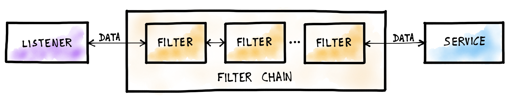

## Part 5: GRPC-JSON Transcoder

As explained in the very first step, Istio makes use of the Envoy Proxy. The clusters contains one or more standalone Envoy instances, in our case we have one which is the ingress-gateway. Besides the standalone proxy, every pod is injected a proxy (this is called a sidecar). That sidecar proxy will receive all traffic and is responsible for forwarding it to the application instance. The sidecar will also be used to transcode GRPC to JSON, before its forwarded.

### Filters

A proxy receives traffic and forwards it, between those steps it might act on the traffic. The Envoy Proxy acts on the traffic using a concept called filters. It uses filters for: metrics, routing, authentication and more. The image below depicts this concept. [Source](https://blog.envoyproxy.io/how-to-write-envoy-filters-like-a-ninja-part-1-d166e5abec09)



In practice there are usually only two items in main filter chain. One TCP Filter and one HTTP Filter. The HTTP Filter contains its own filter-chain. This is important because that is where our filter will be placed and not in the main chain! If you are interested in the available filter, have a look at the [http_filters documentation](https://www.envoyproxy.io/docs/envoy/v1.13.0/configuration/http/http_filters/http_filters).

We will be using a filter called `envoy.grpc_json_transcoder` that is responsible for the transcoding. However, two problems arise.

#### Configuring Envoy Filters

First of all, the envoy proxies are all managed by Istio, are ephemeral and use the same image. So how are we going to change a configuration specific to the Envoy Proxy? Istio has got us covered with the `EnvoyFilter` kubernetes resource. This custom resource is used for this exact purpose, to modify the filter chain of one or more Envoy Proxies.

Starting from Istio 1.5, the EnvoyFilter resource had a makeover which allows anything in the filter to be modified. Before 1.5 the EnvoyFilter functionality was limited.

It is also important to understand the concept of INBOUND and OUTBOUND traffic. The difference - seen from your application - INBOUND traffic is initiated by another party towards your instance and OUTBOUND traffic is initiated by your application. So when someone makes a GRPC request to your application, it is INBOUND traffic even when your application responds it is still INBOUND traffic. Only when your application makes a request to another server, it is OUTBOUND traffic.

The above concept is used when defining where the EnvoyFilter should be applied. In our case it is only on INBOUND traffic.

#### Providing the Protobuffer Descriptor-Set

Besides modifying the Envoy Proxy configuration, the `envoy.grpc_json_transcoder` filter also requires the Protobuffer Descriptor-Set which contains the HTTP/JSON routes and the protobuffer properties. Lucky for us, Istio provides a few annotations which can be used to modify the Proxy Sidecar container.

Below is the deployment file used in _Part 3: Exposing the HTTP Health-Check endpoint_.

```yaml
kind: Deployment
metadata:
  labels:
    app: workshop-demo
  name: workshop-demo
spec:
  replicas: 1
  selector:
    matchLabels:
      app: workshop-demo
  template:
    metadata:
      labels:
        app: workshop-demo
    spec:
      containers:
        - image: workshop/demo
          imagePullPolicy: Never
          name: workshop-demo
```

Notice that the deployment contains a `template` for the pod. This template defines what containers run in the pod and the sidecar Proxy is not specified. Earlier on we have labeled our namespace with `auto-inject`, Istio will automatically inject the sidecar whenever we create a new pod.

The sidecar Proxy is automatically injected based on the template. Before Istio injects the sidecar, it reads the annotations in the template. One of those annotations is the following.

```
sidecar.istio.io/userVolume
sidecar.istio.io/userVolumeMount
```

These annotations closely resemble how you would mount a volume into your own container. We will be using JSON in the annotation, but it might be possible to use yaml with the multine character

```yaml
property: |
  this
  is
  all
  multine
  text
```

```yaml
...
  containers:
    ...
      volumeMounts:
        - name: config-vol
          mountPath: /etc/config
  volumes:
    - name: config-vol
      ...
...
```

Before we can mount the descriptor-set, it has to be available in the cluster. To get the descriptor-set in the cluster, we will create a ConfigMap of it. A ConfigMap is a Kubernetes resource which contains configurations, this might also include files and we can mount that file! Let us create a config map of the created descriptor-set by using the kubectl cli.

```
$ kubectl create configMap workshop-descriptor-set --from-file=../4_proto_http_mapping/helloworld.pb
```

### Putting it together

Start with modifying the deployment by adding the sidecar volume mounts. We will be mounting `helloworld.pb` from the `workshop-descriptor-set` ConfigMap to the sidecar at `/etc/envoy`. This will result in the descriptor-set being available at `/etc/envoy/helloworld.pb` in the sidecar.

```yaml
template:
  metadata:
    annotations:
      sidecar.istio.io/userVolume: '[{"name":"descriptor","configMap":{"name":"workshop-descriptor-set","items":[{"key":"helloworld.pb","path":"helloworld.pb"}]}}]'
      sidecar.istio.io/userVolumeMount: '[{"name":"descriptor","mountPath":"/etc/envoy"}]'
```

At last we create the Envoy Filter. The following resource will modify the Envoy Proxy configuration on the workshop-demo sidecar. The filter will be applied as HTTP_FILTER only on the sidecar INBOUND traffic. The filter will be placed right before the `envoy.router` http filter. The envoy.router filter must always be the last filter. Finally we will `patch` the config by adding the `envoy.grpc_json_transcoder` filter with accompanying configuration.

**GRPC-JSON Transcoder Envoy Filter**

```yaml
apiVersion: networking.istio.io/v1alpha3
kind: EnvoyFilter
metadata:
  name: workshop-demo-filter
spec:
  workloadSelector:
    labels:
      app: workshop-demo
  configPatches:
    - applyTo: HTTP_FILTER
      match:
        context: SIDECAR_INBOUND
        listener:
          # portNumber: 5000
          filterChain:
            filter:
              name: "envoy.http_connection_manager"
              subFilter:
                name: "envoy.router"
      patch:
        operation: INSERT_BEFORE
        value:
          name: envoy.grpc_json_transcoder
          config:
            proto_descriptor: /etc/envoy/helloworld.pb
            services:
              - helloworld.Greeter
            print_options:
              add_whitespace: true
              always_print_primitive_fields: true
              always_print_enums_as_ints: false
              preserve_proto_field_names: false
```

To add emphasize on certain parts:

**What traffic this applies on**

```yaml
spec:
  workloadSelector:
    labels:
      app: workshop-demo
  configPatches:
    - match:
        context: SIDECAR_INBOUND
```

**Match on the following (will be used as point of origin)**

```yaml
spec:
  configPatches:
    - ...
      # This is a HTTP Filter not a main filter!
      applyTo: HTTP_FILTER
      match:
        listener:
          filterChain:
            filter:
              name: "envoy.http_connection_manager"
              # The subFilter will be used as point of origin
              # the patch defined "INSERT_BEFORE". That means
              # insert before envoy.router.
              subFilter:
                name: "envoy.router"
```

**Modify the config with this patch**

```yaml
spec:
  configPatches:
    - ...
      patch:
        operation: INSERT_BEFORE
        value:
          name: envoy.grpc_json_transcoder
          config:
            # this is our mounted descriptor-set
            proto_descriptor: /etc/envoy/helloworld.pb
            services:
              - helloworld.Greeter
            # Extra options for printing the json
            print_options:
              add_whitespace: true
              always_print_primitive_fields: true
              always_print_enums_as_ints: false
              preserve_proto_field_names: false
```

## Troubleshooting

Unfortunately things might not work, let us try and figure out why.

First we have to try and establish what kind of error we are getting:

### Routing issue

A 404 error is usually due to a routing issue, which means you have most likely misconfigured a Virtual Service, service or gateway.

- **For the Virtual Service, make sure:**

  - you are using the correct match labels: `prefix`, `exact`, `regex`,
  - you are incorrectly rewriting the url:
    - when using `prefix` only the prefixed part is rewritten the remainder is concatenated.
  - you are routing traffic towards the correct service port:

    - When your gateways listens on any port but 80 and your service listens on 80 then you will have to change the destination port to 80 in the Virtual Service:

      ```yaml
      . . .
      route:
        - destination:
            host: my-awesome-service
            port: 80
      ```

- **For the Service, make sure:**
  - you are correctly referencing your application ports,
  - you have specified `containerPort` in your pod template ([See link](https://kubernetes.io/docs/concepts/services-networking/connect-applications-service/#exposing-pods-to-the-cluster))
- **For the Gateway, make sure:**
  - you have specified the correct hostname. (use `"*"` to allow all hostnames)

## [Part 6: Adding authentication to our app](../6_adding_auth_app/readme.md)
